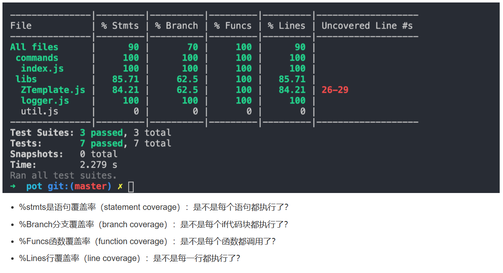

# leetcode

## 介绍

leetcode 解题

## 参与项目

1. 拉代码

2. 运行命令

```shell
npx husky install
```

3. 新建分子

4. 提交代码

#### 提交代码

```shell
npm run commit
```

根据提示填写

**Write a short, imperative tense description of the change(max 94 chars):**
选项添加 #LEETCODE-0

一步步提交

希望每个题都可以加上单元测试, 并完成指定覆盖率


